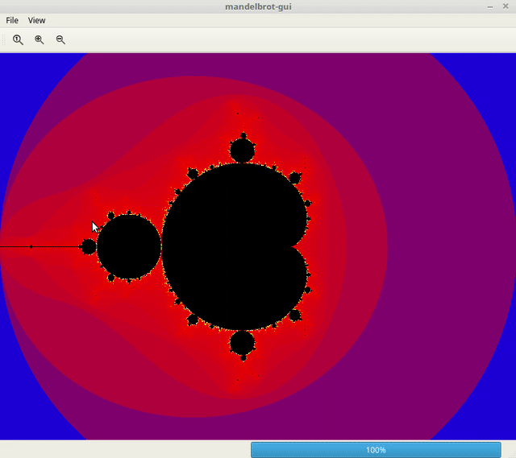

# mandelbrot-gui

A Qt application that generate mandelbrot image. This application can center and zoom in on the image. In addition, it can save the image to file.

## Build 

Run `qmake -makefile` to generate Makefile.
Then, run `make` to build the mandelbrot-gui executable.

## Example run

